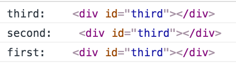
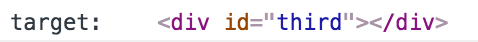

# 과제
중첩된 DOM에 이벤트핸들러가 모두 등록되었을때, 어떤 순서대로 발생하는지를 설명하세요.

## 1. 각 태그별로 이벤트 핸들러를 적용.
- 마지막 자식 엘리먼트부터 최상위 엘리먼트 순으로 발생한다.

  

  ```javascript
  var first = document.getElementById("first");
  var second = document.getElementById("second");
  var third = document.getElementById("third");

  first.addEventListener("click",function(evt){
    var target = evt.target;
    console.log("first: ",target);
  });
  second.addEventListener("click",function(evt){
    var target = evt.target;
    console.log("second: ",target);
  });
  third.addEventListener("click",function(evt){
    var target = evt.target;
    console.log("third: ",target);
  });
  ```
## 2. document 에 이벤트 핸들러를 적용.
- 마지막 자식 엘리먼트만 발생.

  

  ```javascript
  document.addEventListener("click",function(evt){
    var target = evt.target;
    console.log("target: ", target);
  });
  ```
